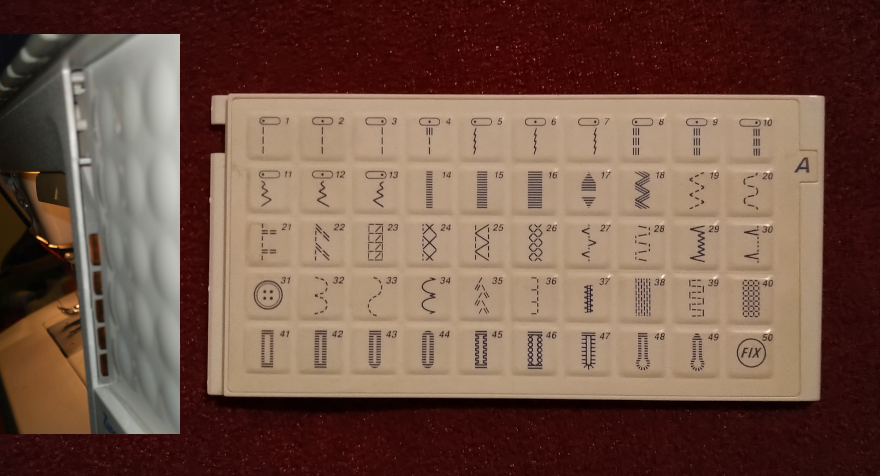

# Husqvarna Embroidery Cards
I have a husqvarna 1250 but this should also work with a husqvarna 1200. Fell free to improve or enhance this documentaiton!

## Basic information
The cards have a key on the left that encodes how five contacts inside of the machine are pushed. Each card can unlock up to 50 designs that are already stored on the machine. You can unlock them by simply pushing the right buttons, every card has a different code. You can easily find new codes on photos of the cards (e.g. on Ebay).

### Code
Right now I only have the card from the picture above, wich isn't ideal for reverse engineering. 

Right now I assume that the card works like this:
* The gap on the top comes after five milimeters and is around six or seven milimeters wide. It has to exist to be able to insert a card
* The encoding happens on the bottom of the card. The upper pin is biger than the four pins below, I would say around 7 mm
* The four pins on the bottom all look like they have a width of 5 mm

## List of Cards

Pins pushed (beginning on the top) |  Motives | 
|---|---|
|  all | Basic stitches (see obove)  |
| 1,2,3,4 (basic card upside down)  |  leaves and hearts |
|   |   | 

## How to recreate the cards
Right now I am working with cuppoard and a sissior, but I hope I will improve my approach over time.
